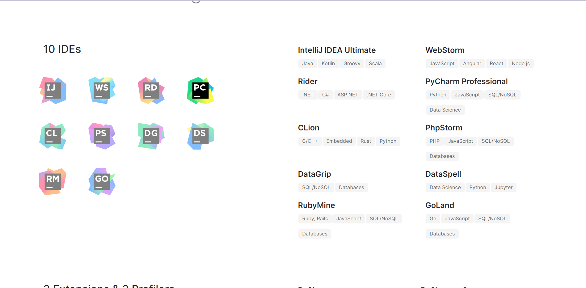
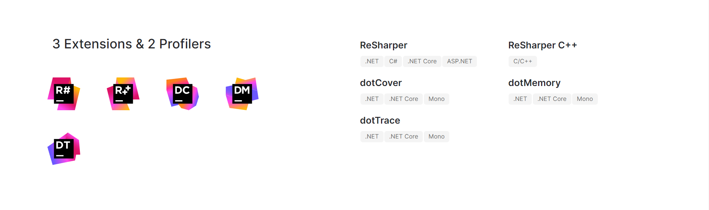
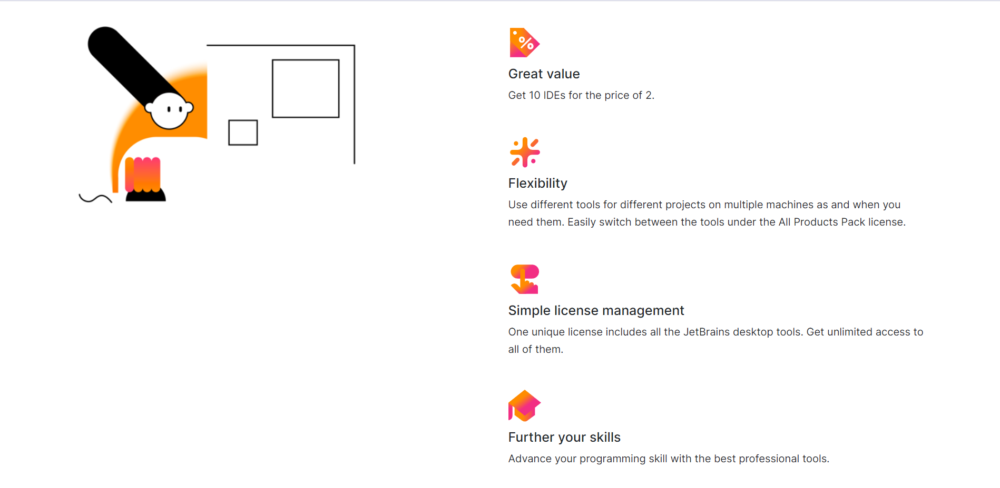
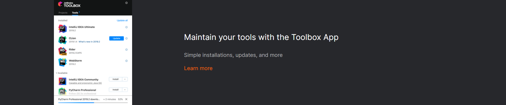
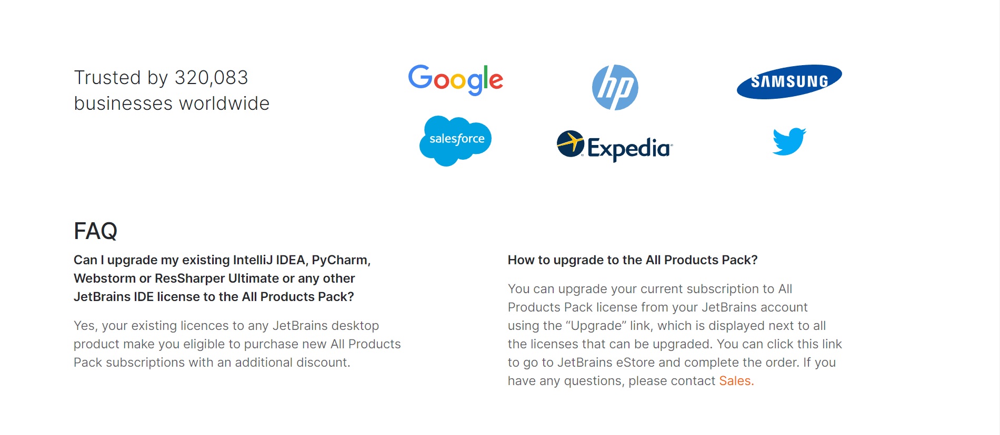
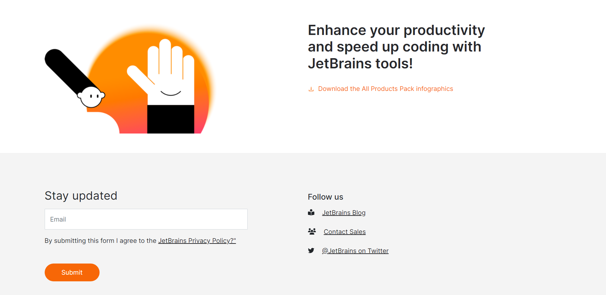
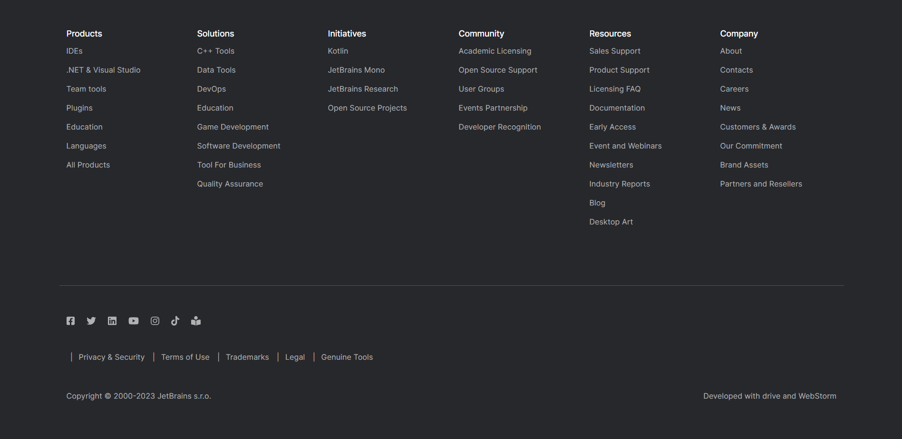

# All Products Pack

This project was bootstrapped with [Create React App](https://github.com/facebook/create-react-app)

This project was made with [WebStorm](https://www.jetbrains.com/webstorm/promo/?source=google&medium=cpc&campaign=9641686230&term=webstorm&content=523833970727&gad=1&gclid=CjwKCAjwpayjBhAnEiwA-7ena4Lzz8FtG9z59izA4roxwg7ZNHrKz_D9nJke8xkqDsv_XWo5rspV2hoClQcQAvD_BwE)
## Description
The All Products Pack serves as the main landing page for the JetBrains website, showcasing their range of software products and services. React UI for All Products Pack website. The project was built with React Bootstrap with a component approach in WebStorm IDE. Note: This is a test assignment.

## Breakpoints
|  Breakpoint  |  Class infix  | Dimensions |
|  ----------- |  ------------ |----------- |
|  X-Small	   |  None         |   <576px   |
|  Small       |  ```sm```  	 |   ≥576px   |
|  Medium      |  ```md```     |   ≥768px   |
|  Large       |  ```lg```     |   ≥992px   |
|  Extra large |  ```xl```     |   ≥1200px  |
|  Extra extra large |  ```xxl```| ≥1200px  |

## PostCSS Plugins
* #### ```postcss-custom-media```
* #### ```postcss-nested```
* #### ```autoprefixer```
* #### ```cssnano```

## Home Page


### 10 IDEs


### 3 Extensions & 2 Profilers


### Values


### Toolbox App


### Sponsors & FAQ


### Download JetBrains Tools & Newsletter


### Footer


